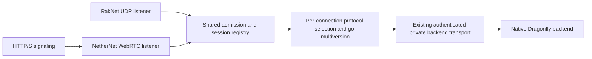

# Public RakNet and NetherNet admission

Status: proposed consumer design. No production listener has been enabled by this
document. The protocol-2223 branch is wire preparation; native data and real-client
validation remain separate gates.

## Ownership and current seams

- `go-raknet` and `go-nethernet` own their transport mechanics.
- gophertunnel owns Minecraft framing, authentication, connection bootstrap and
  transport capabilities. Its pinned fork already exposes `ListenNetwork`,
  `NetherNet`, and a `ListenerGroup` that shares player-count admission between
  listeners. The group does not implement account replacement or session routing.
- go-multiversion owns historical wire and semantic conversion. It does not bind
  public sockets, implement signaling or choose product transport policy.
- Spectrum owns accepted player sessions, backend discovery and switching.
- BRBW owns regional public endpoints, certificates, operator identity, enabled
  protocols and transport settings, lifecycle wiring and actual-client validation.

Reference seams are the [gophertunnel listener](https://github.com/shawtymarco/gophertunnel/blob/34adb6db991480b8a7665959d10226078cf279fa/minecraft/listener.go),
[NetherNet adapter](https://github.com/shawtymarco/gophertunnel/blob/34adb6db991480b8a7665959d10226078cf279fa/minecraft/nethernet.go),
and [current Spectrum listener](https://github.com/shawtymarco/spectrum/blob/6c2de433179d/spectrum.go).
Spectrum currently binds RakNet and stores one listener. It needs a generic way
to adopt multiple `minecraft.Listener` instances into one Spectrum owner; creating
two unrelated Spectrum instances would split account replacement and routing.

## Admission and session state

1. The consumer creates one listener group, authentication policy, supported
   protocol catalogue, aggregate status provider and logical admission owner.
2. It opens RakNet plus the signaling/WebRTC resources. If any required transport
   fails to bind, startup closes every resource already opened and fails as a unit.
3. Bounded accept loops submit authenticated `minecraft.Conn` instances to one
   Spectrum registry. Each accepted connection has an opaque generation and its
   original listener/transport owner for disconnect and diagnostics.
4. Minecraft protocol selection remains per connection, using network settings or
   legacy Login plus GameVersion where required. Transport selection never implies
   a protocol version: versions supporting both may arrive through either listener.
5. Duplicate-account admission uses the existing product session/lease transition.
   A retiring connection may only remove its own generation. Concurrent RakNet and
   NetherNet logins must not leave two active sessions or erase the winning route.
6. Switching backend keeps the original public connection and its transport alive.
   Reconnecting to another public region uses a compatible public endpoint on that
   region and must preserve the configured server trust identity.
7. Shutdown first closes admission and all public listeners/signaling resources,
   then cancels and joins accepted initialization work before retiring sessions and
   backend streams. Every partial startup and failed login follows the same owner.

ListenerGroup maximum/count and `/v1/join` metadata must use the combined logical
server count. Independent limits for pending signaling and unauthenticated handshakes
are still needed because authenticated player count does not bound those resources.
Authentication is enabled on both public transports; NetworkID is an opaque transport
identifier and never substitutes for verified account identity.

## Endpoint and framing requirements

RakNet occupies its configured UDP endpoint. NetherNet needs HTTP/S signaling and
reachable WebRTC UDP candidates. TCP and UDP may share a numeric port, but the
WebRTC UDP binding must not collide with the RakNet socket. Choose an explicit
separate UDP endpoint/range first; a shared UDP socket would require a validated
STUN/DTLS/RakNet demultiplexer and is outside this initial design.

The signaling response must advertise public reachable candidates rather than
Docker/private addresses. Public HTTP/S, ICE UDP forwarding and certificates must
all be represented in the consumer configuration and deployment topology. A
successful HTTP probe alone does not establish a working WebRTC data connection.
The server operator identity key is persistent and distinct from the TLS key.

Connection wrappers must forward `packet.TransportCapabilities`, including
BatchHeader, DisableEncryption and ReadPacket. RakNet framing/Minecraft encryption
and NetherNet transport framing/encryption are selected by the actual connection,
not global flags. NetherNet encryption capabilities must not disable authentication
or encryption for a separate RakNet connection.

An attempted NetherNet connection must not silently downgrade server authentication
or reopen the same account through RakNet. Client transport fallback behavior is
separate from the server accepting both transports.

## Validation before enablement

| Boundary | Automated checks | Real-client checks |
| --- | --- | --- |
| Transport | Simultaneous accepts, capability forwarding, framing/crypto, no socket collisions | Exact-build NetherNet and historical RakNet connection |
| Admission | Shared count/limit, concurrent duplicate account, abandoned signaling/login, generation-safe cleanup | Reconnect through the other transport |
| Protocol | Same version independently selected on each supported transport, historical packet oracles | Login, packs, chunks, inventory and UI with correct registries |
| Routing | Backend switch retains public transport, retired backend packets rejected, stream shutdown | Lobby/game/replay and public regional transfer |
| Lifecycle | Partial-bind rollback, cancel/join, bounded pending accepts, idempotent close | Recovery after listener/server restart |
| Deployment | Signaling and UDP endpoint configuration, reachable candidate assertions, certificate/trust validation | External network and device matrix, rather than loopback alone |

The new go-multiversion CI runs library regressions, independent packet oracles and
the exact pinned gophertunnel transport/session tests. It does not yet prove the
proposed multi-listener Spectrum owner, HTTP/ICE reachability or Mojang-client
semantics. Those integration tests belong with the future gophertunnel/Spectrum
and BRBW implementation and must be added to their owning pipelines.
